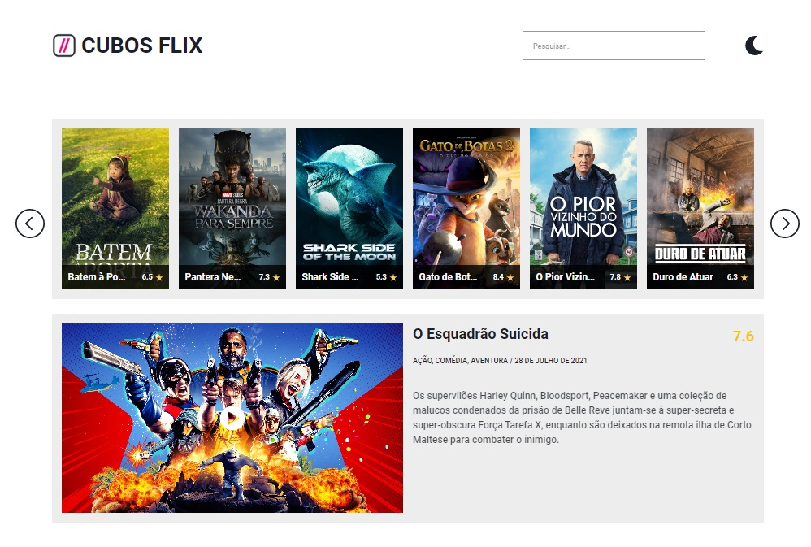

# CubosFlix
## Página inicial
CubosFlix é uma plataforma de streaming que oferece sugestões diárias de filmes. Através de palavras-chave, é possível pesquisar e receber sugestões personalizadas de filmes. Além disso, a plataforma permite que o usuário alterne entre os modos claro e escuro.

## Pesquisa
Para pesquisar filmes na plataforma, basta clicar na barra de pesquisa e digitar as palavras-chave desejadas, em seguida, pressionar a tecla "enter".

 
## Mudança de tema
Para alternar entre o tema claro e escuro, basta clicar no ícone de lua (quando estiver em tema claro, para mudar pro escuro), ou no ícone de sol.

## Navegação
Ao acessar a página, o usuário é imediatamente apresentado a um carrossel que exibe 18 filmes, divididos em 3 páginas de 6 títulos cada. Quando uma pesquisa é realizada, esses filmes são substituídos por títulos relacionados à pesquisa. Para navegar entre as páginas, basta clicar nas setas localizadas à direita e à esquerda do carrossel.

## Modal
Ao clicar em um dos filmes presentes no carrossel, um modal é aberto, exibindo informações importantes sobre o filme, tais como: título, sinopse, gêneros e pontuação.

## Fechar modal
Para fechar o modal, basta clicar no X no canto superior direito do mesmo..

## Filme do Dia
Por fim, há uma seção dedicada ao "filme do dia". Nessa seção, estão disponíveis as mesmas informações presentes no modal, incluindo título, sinopse, gêneros e pontuação. Além disso, há a opção de assistir ao trailer do filme.

